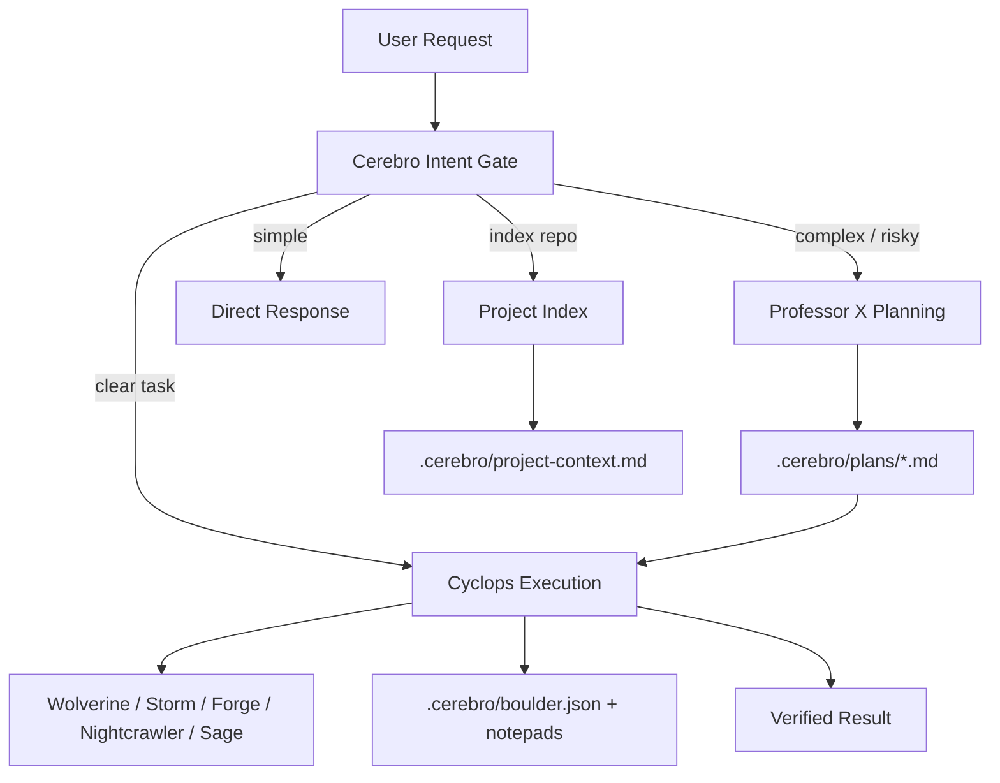

# Cerebro Agentic Workflow

This is the operational workflow for the Claude Code template.

## Runtime Architecture

## Commands

| Command | Purpose |
|---|---|
| `/to-me-my-x-men [task]` | Autonomous execution for clear tasks; asks before using Cerebro's own judgment on unclear product-shaped prompts. |
| `/cerebro-index` | Build or refresh repository context. |
| `/cerebro-plan [task]` | Interview-first planning with Professor X. |
| `/cerebro-start-work` | Execute or resume the latest Cerebro plan. |
| `/cerebro-doctor` | Validate command names, model/effort routing, agent frontmatter, plan template, and stop hook health. |
| `/cerebro-upgrade <ref>` | Sync template-owned files from the upstream repo at a tagged release. |

## State Files

| Path | Owner | Purpose |
|---|---|---|
| `.cerebro/schemas/boulder.schema.json` | Cyclops | Required shape for resumable execution state. |
| `.cerebro/scripts/check-agent-teams-enabled.py` | Cerebro | Reusable doctor check for Claude Code agent-team environment settings. |
| `.cerebro/scripts/ensure-upgrade-cache-gitignored.py` | Cerebro | Reusable helper that keeps `.cerebro/upgrade-cache/` ignored. |
| `.cerebro/scripts/fetch-upstream-ref.py` | Cerebro | Reusable helper that fetches an upstream upgrade ref and prints its SHA. |
| `.cerebro/scripts/reset-runtime.py` | Cerebro | Reusable scan/reset/verify helper for `/cerebro-reset`. |
| `.cerebro/scripts/setup-status.py` | Cerebro | Reusable wiring and version helper for `/cerebro-setup`. |
| `.cerebro/scripts/test-stop-hook.py` | Cerebro | Reusable doctor check for Stop hook blocking behavior. |
| `.cerebro/scripts/upgrade-latest-tag.py` | Cerebro | Reusable helper that resolves the latest upstream version tag. |
| `.cerebro/scripts/validate-agent-frontmatter.py` | Cerebro | Reusable doctor check for native agent frontmatter. |
| `.cerebro/scripts/validate-boulder.py` | Cerebro | Reusable doctor check for `.cerebro/boulder.json`. |
| `.cerebro/scripts/validate-team-runs.py` | Cerebro | Reusable doctor check for the team-run template and manifests. |
| `.cerebro/scripts/validate-upgrade-metadata.py` | Cerebro | Reusable doctor check for upgrade manifest and upgrade state metadata. |
| `.cerebro/scripts/write-upgrade-state.py` | Cerebro | Reusable helper that atomically writes upgrade baseline hashes. |
| `.cerebro/templates/plan.md` | Professor X | Canonical plan schema. |
| `.cerebro/templates/project-context.md` | Cerebro | Canonical repository index schema. |
| `.cerebro/project-context.md` | Cerebro | Indexed stack, commands, conventions, entrypoints, and risks. |
| `.cerebro/plans/*.md` | Professor X | Approved implementation plans. |
| `.cerebro/boulder.json` | Cerebro | Business-level execution checkpoint: active plan, overall status, approvals, verification history, and decisions. Task progress lives in the native TaskList. |
| `.cerebro/notepads/{plan}/conventions.md` | Cyclops | Coding patterns, naming, file structure, UI patterns. |
| `.cerebro/notepads/{plan}/commands.md` | Cyclops | Useful install/test/lint/build/dev commands. |
| `.cerebro/notepads/{plan}/decisions.md` | Cyclops | Approval decisions and architectural decisions. |
| `.cerebro/notepads/{plan}/gotchas.md` | Cyclops | Subtle traps, edge cases, unexpected behavior. |
| `.cerebro/notepads/{plan}/failures.md` | Cyclops | Failed approaches and why. |
| `.cerebro/notepads/{plan}/verification.md` | Cyclops | Verification commands and outcomes. |
| `.cerebro/notepads/{plan}/issues.md` | Cyclops | Blockers, deferred work, unresolved risks. |
| `.cerebro/pending-todos/{team}/{agent}/{task-id}.txt` | Wolverine / Storm | Task-scoped worker todos enforced by the stop hook. |
| `.cerebro/.pending-todos` | Wolverine / Storm | Legacy worker todo file still honored by the stop hook for old runs. |
| `.cerebro/upgrade-manifest.json` | Cerebro | Declares file ownership for `/cerebro-upgrade`. Controls which files are overwritten, merged, or left untouched. |
| `.cerebro/upgrade-state.json` | Cerebro | Baseline hashes written after each successful upgrade. Drives change detection on the next run. |
| `.cerebro/upgrade-cache/<ref>/` | Cerebro | Shallow clones of upstream refs (gitignored). |
| `.cerebro/schemas/upgrade-manifest.schema.json` | Cerebro | JSON Schema for the upgrade manifest. |
| `.cerebro/schemas/upgrade-state.schema.json` | Cerebro | JSON Schema for the upgrade state baseline. |

## Upgrading from Upstream

`/cerebro-upgrade <ref>` syncs template-owned files from the upstream `claude-xmen` repo at an explicit tagged release (e.g. `v0.3.0`). It never touches user-owned paths and gates all writes to merge-owned files.

### How It Works

1. **Arg validation** — `<ref>` must be an explicit tag or SHA; `HEAD`, `main`, and `master` are rejected.
2. **Gate D** — checks for uncommitted changes in template/merge-owned paths before any write.
3. **Fetch** — shallow-clones the upstream repo into `.cerebro/upgrade-cache/<ref>/`.
4. **Classify** — each manifest entry is classified as `add`, `delete`, `modify-template`, `modify-merge-clean`, `modify-merge-conflict`, or `noop` by comparing local vs upstream content against the recorded baseline.
5. **Apply** — template-owned files are written silently; merge-owned conflicts trigger Gate A.
6. **Report** — a change table is printed to chat and written to `.cerebro/upgrade-cache/<ref>/report.md`.
7. **Gate B** — if the upstream manifest differs from the local manifest, the user chooses how to reconcile.
8. **State write** — `.cerebro/upgrade-state.json` is written atomically (tempfile+rename) with the applied SHA and post-upgrade working-tree file hashes.

### Approval Gates

| Gate | Trigger | Choices |
|---|---|---|
| **Gate A** | Merge-owned file changed on both sides since baseline | keep local, take upstream, merge manually, skip |
| **Gate B** | Upstream manifest differs from local manifest | adopt upstream, merge entries, leave local |
| **Gate C** | Template-owned file drifted from baseline (`--strict` only) | overwrite, skip |
| **Gate D** | Uncommitted changes in owned paths | commit/stash first, or pass `--force-dirty` |

### Flags

- `--dry-run` — show the change report without writing anything.
- `--strict` — pause Gate C before overwriting any template-owned file that has drifted locally.
- `--force-dirty` — continue after Gate D finds uncommitted changes in owned paths.
- `--only <glob>` — restrict the upgrade to files matching this glob.

### v1 Known Gaps

- No automated rollback after partial success — use `git restore .` to undo any written files.
- Symlinks and executable bits are not preserved. After upgrade, manually run `chmod +x .claude/hooks/*.sh`.
- Only supports the canonical upstream remote (`https://github.com/yelaco/claude-xmen.git`); fork remotes are not supported.

## Skills

Skills are optional overlays. They may improve task-specific execution or verification, but the base workflow must continue without them. `.cerebro` contracts, approval gates, and result envelopes stay authoritative when a skill gives conflicting advice.
