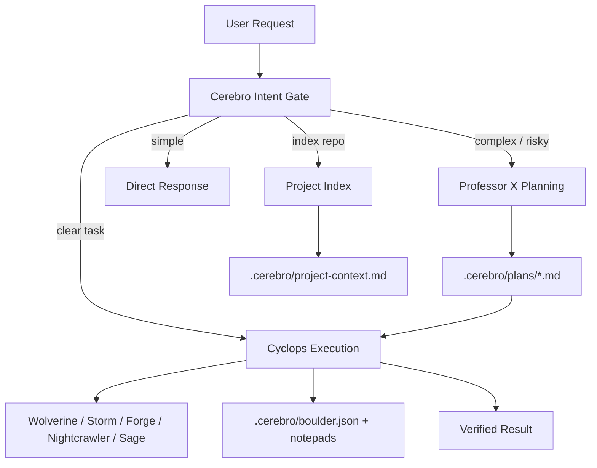

# Cerebro Agentic Workflow

This is the operational workflow for the Claude Code template.

## Runtime Architecture

## Commands

| Command | Purpose |
|---|---|
| `/to-me-my-x-men [task]` | Autonomous execution for clear tasks. |
| `/cerebro-index` | Build or refresh repository context. |
| `/cerebro-plan [task]` | Interview-first planning with Professor X. |
| `/cerebro-start-work` | Execute or resume the latest Cerebro plan. |
| `/cerebro-doctor` | Validate command names, model/effort routing, agent frontmatter, plan template, and stop hook health. |

## State Files

| Path | Owner | Purpose |
|---|---|---|
| `.cerebro/agent-models.json` | Cerebro | Per-agent model and effort aliases used for Agent invocations. |
| `.cerebro/schemas/boulder.schema.json` | Cyclops | Required shape for resumable execution state. |
| `.cerebro/templates/plan.md` | Professor X | Canonical plan schema. |
| `.cerebro/templates/project-context.md` | Cerebro | Canonical repository index schema. |
| `.cerebro/project-context.md` | Cerebro | Indexed stack, commands, conventions, entrypoints, and risks. |
| `.cerebro/plans/*.md` | Professor X | Approved implementation plans. |
| `.cerebro/boulder.json` | Cyclops | Active plan, completed tasks, remaining tasks, approval state. |
| `.cerebro/notepads/{plan}/conventions.md` | Cyclops | Coding patterns, naming, file structure, UI patterns. |
| `.cerebro/notepads/{plan}/commands.md` | Cyclops | Useful install/test/lint/build/dev commands. |
| `.cerebro/notepads/{plan}/decisions.md` | Cyclops | Approval decisions and architectural decisions. |
| `.cerebro/notepads/{plan}/gotchas.md` | Cyclops | Subtle traps, edge cases, unexpected behavior. |
| `.cerebro/notepads/{plan}/failures.md` | Cyclops | Failed approaches and why. |
| `.cerebro/notepads/{plan}/verification.md` | Cyclops | Verification commands and outcomes. |
| `.cerebro/notepads/{plan}/issues.md` | Cyclops | Blockers, deferred work, unresolved risks. |
| `.cerebro/.pending-todos` | Wolverine / Storm | Active worker todos enforced by the stop hook. |

## Skills

Skills are optional overlays. They may improve task-specific execution or verification, but the base workflow must continue without them. `.cerebro` contracts, approval gates, and result envelopes stay authoritative when a skill gives conflicting advice.
