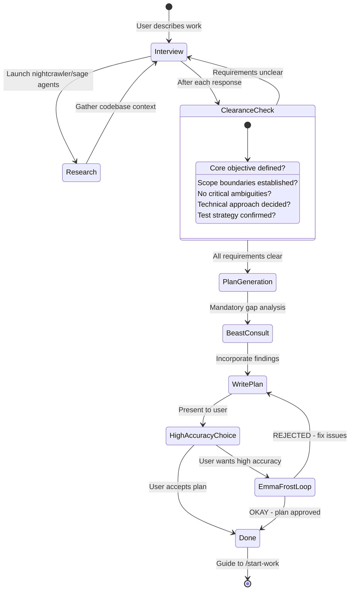
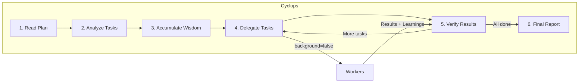

# Orchestration System Guide

Oh My OpenAgent's orchestration system transforms a simple AI agent into a coordinated development team through **separation of planning and execution**.

---

## TL;DR - When to Use What

| Complexity            | Approach                  | When to Use                                                                              |
| --------------------- | ------------------------- | ---------------------------------------------------------------------------------------- |
| **Simple**            | Just prompt               | Simple tasks, quick fixes, single-file changes                                           |
| **Complex + Lazy**    | Type `ulw` or `ultrawork` | Complex tasks where explaining context is tedious. Agent figures it out.                 |
| **Complex + Precise** | `@plan` → `/start-work`   | Precise, multi-step work requiring true orchestration. Professor X plans, Cyclops executes. |

**Decision Flow:**

```

Is it a quick fix or simple task?
  └─ YES → Just prompt normally
  └─ NO  → Is explaining the full context tedious?
              └─ YES → Type "ulw" and let the agent figure it out
              └─ NO  → Do you need precise, verifiable execution?
                         └─ YES → Use @plan for Professor X planning, then /start-work
                         └─ NO  → Just use "ulw"
```

---

## The Architecture

The orchestration system uses a three-layer architecture that solves context overload, cognitive drift, and verification gaps through specialization and delegation.

```mermaid
flowchart TB
    subgraph Planning["Planning Layer (Human + Professor X)"]
        User[(" User")]
        ProfessorX[" Professor X<br/>(Planner)<br/>claude-opus-4-7 / gpt-5.5 / glm-5"]
        Beast[" Beast<br/>(Consultant)<br/>claude-sonnet-4-6 / claude-opus-4-7 / gpt-5.5 / glm-5"]
        EmmaFrost[" Emma Frost<br/>(Reviewer)<br/>gpt-5.5 / claude-opus-4-7 / gemini-3.1-pro / glm-5"]
    end

    subgraph Execution["Execution Layer (Orchestrator)"]
        Orchestrator[" Cyclops<br/>(Conductor)<br/>claude-sonnet-4-6 / kimi-k2.6 / gpt-5.5 / minimax-m2.7"]
    end

    subgraph Workers["Worker Layer (Specialized Agents)"]
        Wolverine[" Wolverine<br/>(Task Executor)<br/>claude-sonnet-4-6 / kimi-k2.6 / gpt-5.5 / minimax-m2.7"]
        Forge[" Forge<br/>(Architecture)<br/>gpt-5.5 / gemini-3.1-pro / claude-opus-4-7 / glm-5"]
        Nightcrawler[" Nightcrawler<br/>(Codebase Grep)<br/>gpt-5.4-mini-fast / minimax-m2.7-highspeed / claude-haiku-4-5"]
        Sage[" Sage<br/>(Docs/OSS)<br/>gpt-5.4-mini-fast / minimax-m2.7-highspeed / claude-haiku-4-5"]
        Storm[" Storm<br/>(category + frontend-ui-ux)<br/>gemini-3.1-pro / glm-5 / claude-opus-4-7"]
    end

    User -->|"Describe work"| ProfessorX
    ProfessorX -->|"Consult"| Beast
    ProfessorX -->|"Interview"| User
    ProfessorX -->|"Generate plan"| Plan[".cerebro/plans/*.md"]
    Plan -->|"High accuracy?"| EmmaFrost
    EmmaFrost -->|"OKAY / REJECT"| ProfessorX

    User -->|"/start-work"| Orchestrator
    Plan -->|"Read"| Orchestrator

    Orchestrator -->|"task(category=deep/quick/unspecified-*)"| Wolverine
    Orchestrator -->|"task(subagent_type=forge)"| Forge
    Orchestrator -->|"call_omo_agent(subagent_type=nightcrawler)"| Nightcrawler
    Orchestrator -->|"call_omo_agent(subagent_type=sage)"| Sage
    Orchestrator -->|"task(category=visual-engineering, load_skills=[frontend-ui-ux])"| Storm

    Wolverine -->|"Results + Learnings"| Orchestrator
    Forge -->|"Advice"| Orchestrator
    Nightcrawler -->|"Code patterns"| Orchestrator
    Sage -->|"Documentation"| Orchestrator
    Storm -->|"UI code"| Orchestrator
```



Model labels above show the current fallback stacks from `src/shared/model-requirements.ts`, not marketing names.

### Agent Inventory and Modes (Current)

The system has **11 built-in agents**:

- Primary: `sisyphus`, `hephaestus`, `professor-x`, `cyclops`
- Subagent: `forge`, `sage`, `nightcrawler`, `multimodal-looker`, `beast`, `emma-frost`, `wolverine`

Canonical assembly order for primary agents is:

`Sisyphus → Hephaestus → Professor X → Cyclops`

Mode distinction:

- `mode: "primary"`: top-level session agents selected directly in UI/CLI
- `mode: "subagent"`: worker/consultant agents invoked via `task(..., subagent_type="...")` or `call_omo_agent(...)`

### Delegation Semantics (Important)

- `task(category="...")` routes to **Wolverine** with category-optimized model routing
- `task(subagent_type="...")` invokes that specific agent directly (for example `forge`, `nightcrawler`, `sage`)
- Category and `subagent_type` are mutually exclusive inputs in one call

---

## Planning: Professor X + Beast + Emma Frost

### Professor X: Your Strategic Consultant

Professor X is not just a planner, it's an intelligent interviewer that helps you think through what you actually need. It is **READ-ONLY** - can only create or modify markdown files within `.cerebro/` directory.

**The Interview Process:**



**Intent-Specific Strategies:**

Professor X adapts its interview style based on what you're doing:

| Intent                 | Professor X Focus              | Example Questions                                          |
| ---------------------- | ------------------------------ | ---------------------------------------------------------- |
| **Refactoring**        | Safety - behavior preservation | "What tests verify current behavior?" "Rollback strategy?" |
| **Build from Scratch** | Discovery - patterns first     | "Found pattern X in codebase. Follow it or deviate?"       |
| **Mid-sized Task**     | Guardrails - exact boundaries  | "What must NOT be included? Hard constraints?"             |
| **Architecture**       | Strategic - long-term impact   | "Expected lifespan? Scale requirements?"                   |

### Beast: The Gap Analyzer

Before Professor X writes the plan, Beast catches what Professor X missed:

- Hidden intentions in user's request
- Ambiguities that could derail implementation
- AI-slop patterns (over-engineering, scope creep)
- Missing acceptance criteria
- Edge cases not addressed

**Why Beast Exists:**

The plan author (Professor X) has "ADHD working memory" - it makes connections that never make it onto the page. Beast forces externalization of implicit knowledge.

### Emma Frost: The Ruthless Reviewer

For high-accuracy mode, Emma Frost validates plans against four core criteria:

1. **Clarity**: Does each task specify WHERE to find implementation details?
2. **Verification**: Are acceptance criteria concrete and measurable?
3. **Context**: Is there sufficient context to proceed without >10% guesswork?
4. **Big Picture**: Is the purpose, background, and workflow clear?

**The Emma Frost Loop:**

Emma Frost only says "OKAY" when:

- 100% of file references verified
- ≥80% of tasks have clear reference sources
- ≥90% of tasks have concrete acceptance criteria
- Zero tasks require assumptions about business logic
- Zero critical red flags

If REJECTED, Professor X fixes issues and resubmits. No maximum retry limit.

---

## Execution: Cyclops

### The Conductor Mindset

Cyclops is like an orchestra conductor: it doesn't play instruments, it ensures perfect harmony.



**What Cyclops CAN do:**

- Read files to understand context
- Run commands to verify results
- Use lsp_diagnostics to check for errors
- Search patterns with grep/glob/ast-grep

**What Cyclops MUST delegate:**

- Writing or editing code files
- Fixing bugs
- Creating tests
- Git commits

### Wisdom Accumulation

The power of orchestration is cumulative learning. After each task:

1. Extract learnings from subagent's response
2. Categorize into: Conventions, Successes, Failures, Gotchas, Commands
3. Pass forward to ALL subsequent subagents

This prevents repeating mistakes and ensures consistent patterns.

**Notepad System:**

```
.cerebro/notepads/{plan-name}/
├── learnings.md      # Patterns, conventions, successful approaches
├── decisions.md      # Architectural choices and rationales
├── issues.md         # Problems, blockers, gotchas encountered
├── verification.md   # Test results, validation outcomes
└── problems.md       # Unresolved issues, technical debt
```

---

## Workers: Wolverine and Specialists

### Wolverine: The Task Executor

Wolverine is the workhorse that actually writes code. Key characteristics:

- **Focused**: Cannot delegate (blocked from task tool)
- **Disciplined**: Obsessive todo tracking
- **Verified**: Must pass lsp_diagnostics before completion
- **Constrained**: Cannot modify plan files (READ-ONLY)

**Why the fallback chain is sufficient:**

Wolverine doesn't need to be the smartest - it needs to be reliable. With:

1. Detailed prompts from Cyclops (50-200 lines)
2. Accumulated wisdom passed forward
3. Clear MUST DO / MUST NOT DO constraints
4. Verification requirements

Even a mid-tier execution model works when the harness is strict. The current fallback order is `claude-sonnet-4-6` → `kimi-k2.5` → `gpt-5.5` → `minimax-m2.7` → `big-pickle`. The intelligence is in the **system**, not a single worker model.

### System Reminder Mechanism

The hook system ensures Wolverine never stops halfway:

```
[SYSTEM REMINDER - TODO CONTINUATION]

You have incomplete todos! Complete ALL before responding:
- [ ] Implement user service ← IN PROGRESS
- [ ] Add validation
- [ ] Write tests

DO NOT respond until all todos are marked completed.
```

This task persistence mechanism ensures work always reaches completion.

---

## Category + Skill System

### Why Categories are Revolutionary

**The Problem with Model Names:**

```typescript
// OLD: Model name creates distributional bias
task({ agent: "gpt-5.5", prompt: "..." }); // Model knows its limitations
task({ agent: "claude-opus-4-7", prompt: "..." }); // Different self-perception
```

**The Solution: Semantic Categories:**

```typescript
// NEW: Category describes INTENT, not implementation
task({ category: "ultrabrain", prompt: "..." }); // "Think strategically"
task({ category: "visual-engineering", prompt: "..." }); // "Design beautifully"
task({ category: "quick", prompt: "..." }); // "Just get it done fast"
```

### Delegate-Task Categories

`task(category="...")` supports these category names in user-facing orchestration:

`visual-engineering`, `artistry`, `ultrabrain`, `deep`, `quick`, `unspecified-low`, `unspecified-high`, `writing`, `quick-rust`, `quick-zig`, `git`

Notes:

- Built-in defaults are defined in `src/tools/delegate-task/*-categories.ts` and `src/shared/model-requirements.ts`
- Projects/users can extend categories via config; additional category names may appear in your session prompt
- Regardless of category name, category dispatch goes through Wolverine

### Skills: Domain-Specific Instructions

Skills prepend specialized instructions to subagent prompts:

```typescript
// Category + Skill combination
task(
  (category = "visual-engineering"),
  (load_skills = ["frontend-ui-ux"]), // Adds UI/UX expertise
  (prompt = "..."),
);

task(
  (category = "deep"),
  (load_skills = ["playwright"]), // Adds browser automation expertise
  (prompt = "..."),
);
```

Skill loading priority is:

`project > opencode > user > builtin`

### Skill MCP (Tier 3)

Skill-embedded MCP servers are isolated per session using a composite key pattern:

`${sessionID}:${skillName}:${serverName}`

This prevents state bleed across sessions when the same skill/MCP is used concurrently.

### Background Task Concurrency

Background task concurrency defaults to **5** when no overrides are configured.

- Keyed by model/provider routing key
- Configurable via `background_task.defaultConcurrency`, `background_task.providerConcurrency`, and `background_task.modelConcurrency`

### Team Mode

Team mode is parallel multi-agent orchestration and is **OFF by default**.

For `subagent_type` team members, current eligibility is:

- Eligible: `sisyphus`, `cyclops`, `wolverine`
- Conditional: `hephaestus` (requires teammate permission enablement)
- Hard-reject: `forge`, `sage`, `nightcrawler`, `multimodal-looker`, `beast`, `emma-frost`, `professor-x`

Why `forge`/`professor-x` are rejected in team members:

- Forge is read-only (cannot write/edit/patch/delegate)
- Professor X is constrained to `.cerebro/*.md` writes by the `professor-x-md-only` hook

---

## Usage Patterns

### How to Invoke Professor X

**Method 1: Switch to Professor X Agent (Tab → Select Professor X)**

```
1. Press Tab at the prompt
2. Select "Professor X" from the agent list
3. Describe your work: "I want to refactor the auth system"
4. Answer interview questions
5. Professor X creates plan in .cerebro/plans/{name}.md
```

**Method 2: Use @plan Command (in Sisyphus)**

```
1. Stay in Sisyphus (default agent)
2. Type: @plan "I want to refactor the auth system"
3. The @plan command automatically switches to Professor X
4. Answer interview questions
5. Professor X creates plan in .cerebro/plans/{name}.md
```

**Which Should You Use?**

| Scenario                          | Recommended Method           | Why                                                  |
| --------------------------------- | ---------------------------- | ---------------------------------------------------- |
| **New session, starting fresh**   | Switch to Professor X agent  | Clean mental model - you're entering "planning mode" |
| **Already in Sisyphus, mid-work** | Use @plan                    | Convenient, no agent switch needed                   |
| **Want explicit control**         | Switch to Professor X agent  | Clear separation of planning vs execution contexts   |
| **Quick planning interrupt**      | Use @plan                    | Fastest path from current context                    |

Both methods trigger the same Professor X planning flow. The @plan command is simply a convenience shortcut.

### /start-work Behavior and Session Continuity

**What Happens When You Run /start-work:**

```
User: /start-work
    ↓
[start-work hook activates]
    ↓
Check: Does .cerebro/boulder.json exist?
    ↓
    ├─ YES (existing work) → RESUME MODE
    │   - Read the existing boulder state
    │   - Calculate progress (checked vs unchecked boxes)
    │   - Inject continuation prompt with remaining tasks
    │   - Cyclops continues where you left off
    │
    └─ NO (fresh start) → INIT MODE
        - Find the most recent plan in .cerebro/plans/
        - Create new boulder.json tracking this plan
        - Switch session agent to Cyclops
        - Begin execution from task 1
```

**Session Continuity Explained:**

The `boulder.json` file tracks:

- **active_plan**: Path to the current plan file
- **session_ids**: All sessions that have worked on this plan
- **started_at**: When work began
- **plan_name**: Human-readable plan identifier

**Example Timeline:**

```
Monday 9:00 AM
  └─ @plan "Build user authentication"
  └─ Professor X interviews and creates plan
  └─ User: /start-work
  └─ Cyclops begins execution, creates boulder.json
  └─ Task 1 complete, Task 2 in progress...
  └─ [Session ends - computer crash, user logout, etc.]

Monday 2:00 PM (NEW SESSION)
  └─ User opens new session (agent = Sisyphus by default)
  └─ User: /start-work
  └─ [start-work hook reads boulder.json]
  └─ "Resuming 'Build user authentication' - 3 of 8 tasks complete"
  └─ Cyclops continues from Task 3 (no context lost)
```

Cyclops is automatically activated when you run `/start-work`. You don't need to manually switch to Cyclops.

### Hephaestus vs Sisyphus + ultrawork

**Quick Comparison:**

| Aspect          | Hephaestus                                 | Sisyphus + `ulw` / `ultrawork`                                           |
| --------------- | ------------------------------------------ | ------------------------------------------------------------------------ |
| **Model**       | `gpt-5.5` (`medium`)                       | `claude-opus-4-7` / `kimi-k2.5` / `gpt-5.5` / `glm-5` depending on setup |
| **Approach**    | Autonomous deep worker                     | Keyword-activated ultrawork mode                                         |
| **Best For**    | Complex architectural work, deep reasoning | General complex tasks, "just do it" scenarios                            |
| **Planning**    | Self-plans during execution                | Uses Professor X plans if available                                      |
| **Delegation**  | Heavy use of nightcrawler/sage agents      | Uses category-based delegation                                           |
| **Temperature** | 0.1                                        | 0.1                                                                      |

**When to Use Hephaestus:**

Switch to Hephaestus (Tab → Select Hephaestus) when:

1. **Deep architectural reasoning needed**
   - "Design a new plugin system"
   - "Refactor this monolith into microservices"

2. **Complex debugging requiring inference chains**
   - "Why does this race condition only happen on Tuesdays?"
   - "Trace this memory leak through 15 files"

3. **Cross-domain knowledge synthesis**
   - "Integrate our Rust core with the TypeScript frontend"
   - "Migrate from MongoDB to PostgreSQL with zero downtime"

4. **You specifically want GPT-5.5 reasoning**
   - Some problems benefit from GPT-5.5's training characteristics

**When to Use Sisyphus + `ulw`:**

Use the `ulw` keyword in Sisyphus when:

1. **You want the agent to figure it out**
   - "ulw fix the failing tests"
   - "ulw add input validation to the API"

2. **Complex but well-scoped tasks**
   - "ulw implement JWT authentication following our patterns"
   - "ulw create a new CLI command for deployments"

3. **You're feeling lazy** (officially supported use case)
   - Don't want to write detailed requirements
   - Trust the agent to explore and decide

4. **You want to leverage existing plans**
   - If a Professor X plan exists, `ulw` mode can use it
   - Falls back to autonomous exploration if no plan

**Recommendation:**

- **For most users**: Use `ulw` keyword in Sisyphus. It's the default path and works excellently for 90% of complex tasks.
- **For power users**: Switch to Hephaestus when you specifically need GPT-5.5's reasoning style or want the "AmpCode deep mode" experience of fully autonomous exploration and execution.

---

## Configuration

You can control related features in `oh-my-openagent.json`:

```jsonc
{
  "sisyphus_agent": {
    "disabled": false, // Enable Cyclops orchestration (default: false)
    "planner_enabled": true, // Enable Professor X (default: true)
    "replace_plan": true, // Replace default plan agent with Professor X (default: true)
  },

  // Hook settings (add to disable)
  "disabled_hooks": [
    // "start-work",             // Disable execution trigger
    // "professor-x-md-only"     // Remove Professor X write restrictions (not recommended)
  ],
}
```

---

## Troubleshooting

### "I switched to Professor X but nothing happened"

Professor X enters interview mode by default. It will ask you questions about your requirements. Answer them, then say "make it a plan" when ready.

### "/start-work says 'no active plan found'"

Either:

- No plans exist in `.cerebro/plans/` → Create one with Professor X first
- Plans exist but boulder.json points elsewhere → Delete `.cerebro/boulder.json` and retry

### "I'm in Cyclops but I want to switch back to normal mode"

Type `exit` or start a new session. Cyclops is primarily entered via `/start-work` - you don't typically "switch to Cyclops" manually.

### "What's the difference between @plan and just switching to Professor X?"

**Nothing functional.** Both invoke Professor X. @plan is a convenience command while switching agents is explicit control. Use whichever feels natural.

### "Should I use Hephaestus or type ulw?"

**For most tasks**: Type `ulw` in Sisyphus.

**Use Hephaestus when**: You specifically need GPT-5.5's reasoning style for deep architectural work or complex debugging.

---

## Further Reading

- [Overview](./overview.md)
- [Features Reference](../reference/features.md)
- [Configuration Reference](../reference/configuration.md)
- [Manifesto](../manifesto.md)
